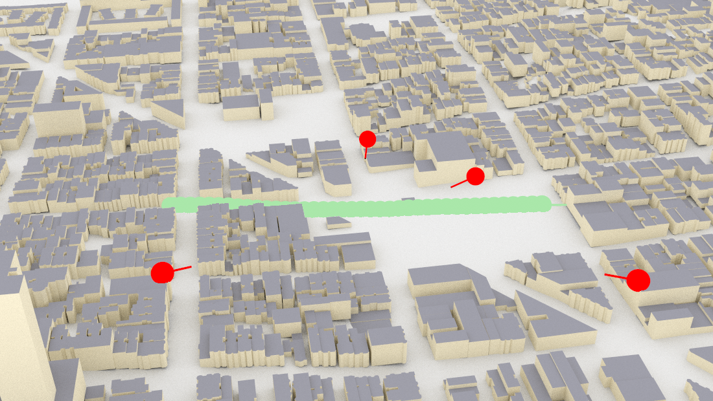
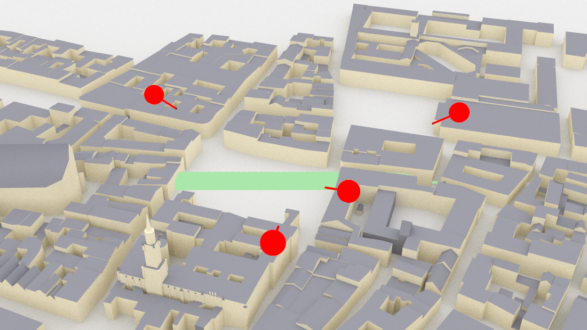
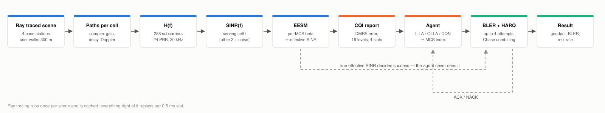
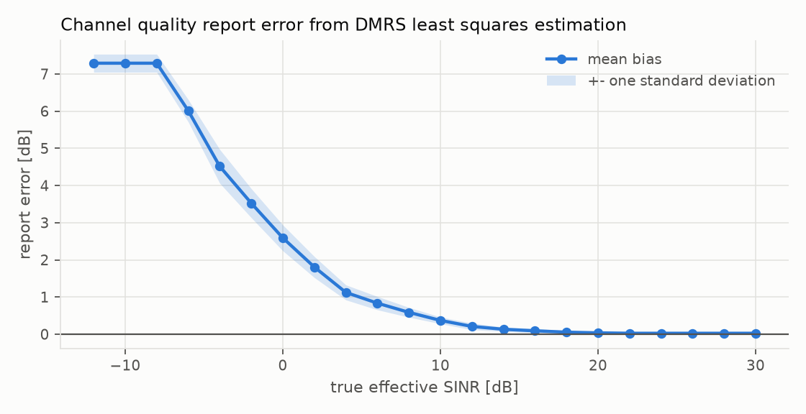
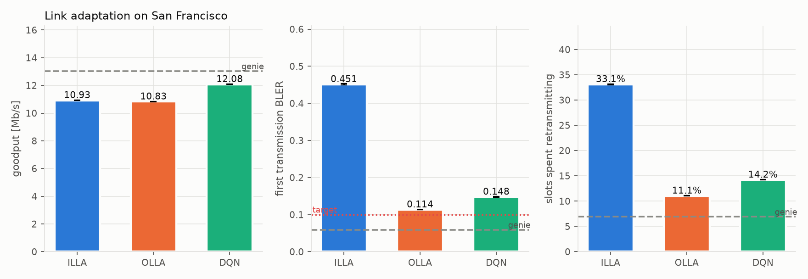

# Link Adaptation

Comparing a DQN agent against ILLA and OLLA for 5G NR link adaptation, over a
ray-traced channel instead of a synthetic one. A user walks 300 m down a street,
served by one of four base stations and interfered with by the other three.

Uses [Sionna 2.0](https://nvlabs.github.io/sionna/) for the ray tracing, PHY
abstraction, EESM and the ILLA/OLLA baselines.

## The scenes

San Francisco — North Beach / Telegraph Hill. Red pins are base stations, green is
the route.



Munich Altstadt, used to check whether a policy trained in one city transfers to
another.



## Signal path



## Link specification

Downlink only, single carrier, one user.

### Waveform and carrier

| Quantity | Value | Source |
|---|---|---|
| Carrier frequency | 3.5 GHz (band n78) | TS 38.101-1 Table 5.2-1 |
| Subcarrier spacing | 30 kHz (numerology mu = 1) | TS 38.211 Table 4.2-1 |
| Slot length, symbols | 0.5 ms, 14 (normal CP) | TS 38.211 Table 4.3.2-1 |
| Cyclic prefix | 2.34 us | TS 38.211 Section 5.3.1 |
| Channel bandwidth | 20 MHz, 51 PRB | TS 38.101-1 Table 5.3.2-1 |
| Allocation | 24 PRB, 288 subcarriers, 8.64 MHz | project choice |
| Duplex | none modelled, downlink only | project choice |

### Antennas

| Quantity | Value | Source |
|---|---|---|
| Configuration | SISO, 1x1, single layer | project choice |
| Base station element | TR 38.901 sector pattern, vertical | TR 38.901 Section 7.3 |
| User element | isotropic, vertical | Sionna RT default |
| Rank / precoding | fixed rank 1, no PMI | project choice |

### Transport

| Quantity | Value | Source |
|---|---|---|
| MCS table | Table 5.1.3.1-1, up to 64QAM | TS 38.214 |
| Usable MCS | 3 to 28 (those with BLER curves) | Sionna `PHYAbstraction` |
| Transport block size | 888 to 21000 bits | TS 38.214 Section 5.1.3.2 |
| DMRS | 12 RE per PRB, one front-loaded symbol | TS 38.211 Section 7.4.1.1 |
| Data resource elements | 3744 per slot | derived |
| Error rate | Sionna `PHYAbstraction`, PDSCH curves | |

### Feedback and HARQ

| Quantity | Value | Source |
|---|---|---|
| CSI report period | 10 slots (5 ms) | TS 38.331 `CSI-ReportPeriodicityAndOffset` |
| CSI report delay | 4 slots (2 ms) | project choice |
| CQI field | 4 bits, 16 levels | TS 38.214 Section 5.2.2.1 |
| HARQ round trip | 4 slots (2 ms) | project choice, k1 plus scheduling |
| HARQ attempts | up to 4, Chase combining | project choice |
| BLER target | 10% | TS 38.214 Section 5.2.2.1 |

### Power and noise

| Quantity | Value | Source |
|---|---|---|
| Base station transmit power | 44 dBm | TR 38.901 Table 7.8-1 |
| User noise figure | 9 dB | TR 38.901 Table 7.8-1 |
| Temperature | 294 K | Sionna default |
| Thermal noise | -120.1 dBm per subcarrier | derived |
| Interference | ray traced from the 3 other cells | |
| Propagation | Sionna RT, ITU-R P.2040 materials | |

Because the three neighbour cells are traced rather than lumped into a noise term,
the link is interference-limited (I/N around 56 dB) and transmit power barely
matters -- a 30 dB change in power moves mean SINR by 0.2 dB.

## Report error

The UE estimates the channel from DMRS pilots by least squares. Noise in that
estimate adds apparent signal power, so the UE overestimates its own SINR, badly
when the link is weak:



| true SINR | bias | spread |
|---|---|---|
| −8 dB | +7.29 dB | 0.24 dB |
| 0 dB | +2.59 dB | 0.35 dB |
| +8 dB | +0.59 dB | 0.13 dB |
| +22 dB | +0.02 dB | 0.03 dB |

`calibrate_report.py` measures this over 3072 trials with Sionna's OFDM chain
(`ResourceGrid` + DMRS, `LSChannelEstimator`, `LMMSEPostEqualizationSINR`) and
writes a table indexed by SINR. This bias is what OLLA's offset loop exists to
cancel.

## Agents

All of them get identical observations and none can see the true effective SINR.

- **ILLA** — highest MCS whose BLER at the reported SINR is under 10%. No way to
  correct a biased report.
- **OLLA** — ILLA plus an offset: +1.0 dB on a NACK, −0.111 dB on an ACK, so it
  settles at 10%.
- **DQN** — Double DQN, 256×256 ReLU. Sees 8 CQI reports, 8 past MCS, 8 past ACKs,
  and fast/slow BLER averages. Its action is an *offset* applied to the ILLA choice,
  −4 to +2, so it learns a state-dependent correction rather than picking an MCS
  outright.
- **Genie** — knows the whole channel ahead of time and solves for the MCS sequence
  maximising expected bits under the same HARQ rules. Upper bound.

ILLA and OLLA come from Sionna. Their decisions are memoised by binary-searching
the exact decision thresholds; `tests/test_agents.py` checks the memoised versions
match Sionna's output exactly.

## Results



San Francisco, 5 seeds:

| agent | goodput | BLER | retx |
|---|---|---|---|
| ILLA | 10.93 Mb/s | 0.451 | 33.1% |
| OLLA | 10.83 Mb/s | 0.114 | 11.1% |
| DQN | **12.08 Mb/s** | 0.148 | 14.2% |
| genie | 13.03 Mb/s | 0.059 | 6.9% |

Munich, same policy, never trained there:

| agent | goodput | BLER | retx |
|---|---|---|---|
| ILLA | 8.52 Mb/s | 0.502 | 35.8% |
| OLLA | 8.63 Mb/s | 0.130 | 12.1% |
| DQN | **9.89 Mb/s** | 0.151 | 14.6% |
| genie | 10.79 Mb/s | 0.074 | 8.4% |

ILLA fails about half its first transmissions because it takes the biased report at
face value. OLLA fixes the error rate but not the throughput — with feedback four
slots late and CQI up to thirteen slots old its offset lags the channel, and it ends
up level with ILLA. The DQN is 12% ahead on San Francisco and 15% on Munich, closing
55–60% of the ILLA-to-genie gap.

`results/` has the tables behind every figure.

## Running

```sh
conda create -n linkadapt python=3.12 && conda activate linkadapt
pip install -r requirements.txt
make trace calibrate train evaluate figures
make test
```

## Layout

```
linkadapt/
  mcs.py        TS 38.214 MCS table
  phy.py        BLER lookup, PDSCH
  raytrace.py   multi-cell ray tracing, route construction
  link.py       subcarrier SINR, interference, CQI report
  agents.py     ILLA, OLLA, DQN, genie
  env.py        per-slot environment, HARQ, common random numbers
scripts/        trace_scene, render_scene, calibrate_report, train, evaluate, make_figures, export_rtl
rtl/            illa.sv, olla.sv, dqn.sv, dqn_la.sv and the exported weights
tb/             one testbench per module and the golden vectors
constraints/    clock constraint for the out of context timing run
results/        figures and tables
```
